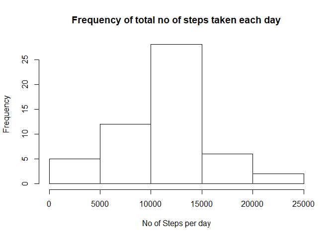

# Reproducible Research: Peer Assessment 1


## Loading and preprocessing the data
The working directory is first set to where the files are located. Next the CSV data is read and placed into the variable called activity:


```r
activity <- read.csv("activity.csv")
```


## What is mean total number of steps taken per day?
The total number of steps is aggregated per day, for which the mean and median are calculated as follows:


```r
steps_day <- tapply(activity$steps, activity$date, sum, na.rm= T)
c(mean(steps_day), median(steps_day))
```

```
## [1]  9354.23 10395.00
```

Using the aggregated variable, a histogram plot of the total no of steps taken each day is created.


```r
hist(steps_day, xlab = "No of Steps per day", ylab = "Frequency", main = "Frequency of total no of steps taken each day")
```

<!-- -->

## What is the average daily activity pattern?

The average no of steps or activity is computed per interval across all days, for which the pattern is plotted.


```r
steps_interval <- aggregate(steps ~ interval, data= activity, FUN= mean, na.rm= T)
plot(steps_interval$interval, steps_interval$steps, type= "l", xlab= "5-min Interval", ylab= "Average", main= "Average steps taken per interval")
```

<!-- -->

The time interval corresponding to the maximum daily average steps can be computed as follows:


```r
steps_interval$interval[which.max(steps_interval$steps)]
```

```
## [1] 835
```

## Imputing missing values

The number of missing or NA records is computed as:


```r
NAs <- which(is.na(activity$steps))
length(NAs)
```

```
## [1] 2304
```

A new variable called activity2 is created equals to the original activity. As an alternative to looping through the NA records, replacing the 'steps' with their mean/median aggregated values at the respective date or interval (as given by steps_interval variable). Using data tables, the median values of steps are aggregated and replicated at each given interval of the day in a new column called msteps. to which NA steps in activity2 are mapped and replaced by.


```r
activity2 <- activity
activity= data.table::as.data.table(activity)
activity[, msteps:= median(steps, na.rm= T), by= interval]
activity2$steps[NAs]= activity$msteps[NAs]
##library(Hmisc); activity2$steps <- impute(activity$steps, FUN= mean) #filling spaces, mean is strictly the same
```

Using the imputed activity data frame, the total number of steps per day is re-calculated and the plot is provided as follows:


```r
steps_day2= aggregate(steps ~ date, data= activity2, FUN= sum, na.rm= T)
hist(steps_day2$steps, xlab = "No of Steps per day", ylab = "Frequency", main = "Frequency of total no of steps taken each day")
```

<!-- -->

The median is unchanged, while the mean has shifted from the original NA-omitted data values. 

```r
c(mean(steps_day2$steps), median(steps_day2$steps))
```

```
## [1]  9503.869 10395.000
```

## Are there differences in activity patterns between weekdays and weekends?

The date in the imputed data (activity2) is used to calculate another new factor variable equals to "weekend" or "weekday" called weekday, for which the average number of steps is calculated per interval, and plotted. The activity pattern is fairly different between both.


```r
activity2$date= as.Date(activity2$date)
activity2$weekday= weekdays(activity2$date)
activity2$weekday= factor(grepl("S(at|un)",activity2$weekday), levels= c(T,F), labels= c("weekend","weekday"))
steps_interval2= aggregate(steps ~ interval + weekday, data= activity2, FUN= mean, na.rm= T)
library(ggplot2)
```

```
## Warning: package 'ggplot2' was built under R version 3.4.1
```

```r
ggplot(steps_interval2, aes(interval, steps)) + geom_line() + facet_grid(.~weekday) + ggtitle("Total steps per interval in weekends and weekdays")
```

<!-- -->
